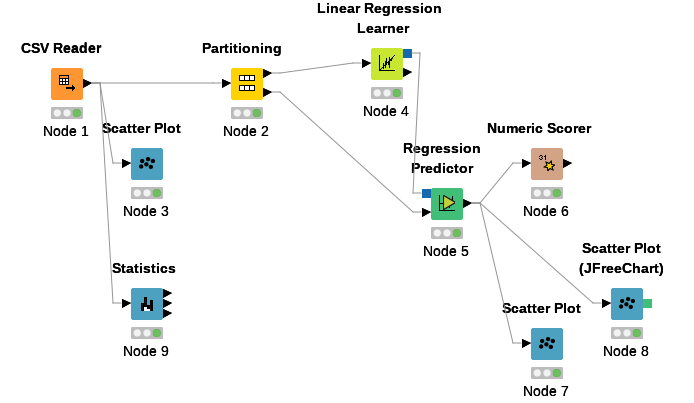

# Demo workflow for KNIME

This workflow demonstrates a linear regression on [Auto MPG dataset from UCI](https://archive.ics.uci.edu/ml/datasets/Auto+MPG).

Goal is to predict mpg depending other variables (displacement, weight, acceleration...).

